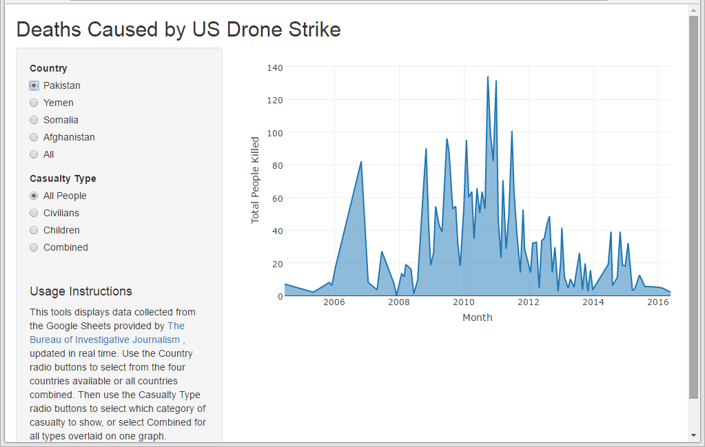

Developing Data Products Final Project - US Drone Strikes
========================================================
author: David Waterman
date: 10/23/2016
autosize: true

US Drone Strikes
========================================================
This webapp downloads data in real time from [The Bureau of Investigative Journalism](https://www.thebureauinvestigates.com/category/projects/drones/drones-graphs/) and displays the data on casualties as a time plot.
The following options are available:

- Country to display
    - Pakistan, Yemen, Somalia, Afghanistan, or All countries combined

- Casualty type to display
    - All People, Civilians, Children, or Combined graph with overlayed plots for all three types

Accessing the App
========================================================
The app is available on the shinyapps.io site, https://drwaterman.shinyapps.io/US_Drone_Strikes/

Example of App Running
========================================================

Source Code
========================================================
The source code for the web application, this presentation, and all associated files is available at github.com,
http://github.com/drwaterman/
